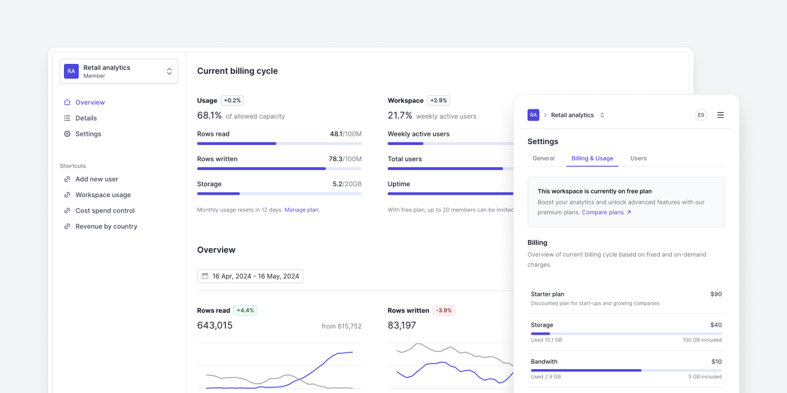

<br />
<div align="center">

<h1 align="center">
  Tremor – Dashboard Template
</h1>

<h3 align="center">
  <a href="https://dashboard-oss.tremor.so/overview">Preview OSS version</a> |
  <a href="https://dashboard.tremor.so/overview">Preview full version</a> |
  <a href="https://blocks.tremor.so/templates">Get full version</a>
</h3>

`Dashboard` is a SaaS application template from [Tremor](https://tremor.so). It's built
using [`Tremor Raw`](https://raw.tremor.so/docs/getting-started/installation)
and [Next.js](https://nextjs.org).

<br />

[](https://dashboard-oss.tremor.so/overview)

</div>

<br />

## Getting started

1. Install the dependencies. We recommend using pnpm. If you want to use `npm`,
   just replace `pnpm` with `npm`.

```bash
pnpm install
```

2. Then, start the development server:

```bash
pnpm run dev
```

3. Visit [http://localhost:3000](http://localhost:3000) in your browser to view
   the template.

## Notes

This project uses
[`next/font`](https://nextjs.org/docs/basic-features/font-optimization) to
automatically optimize and load Inter, a custom Google Font.

This project uses
[`Tremor Raw`](https://raw.tremor.so/docs/getting-started/installation)
components for the UI.

## License

This site template is licensed under the
[Apache 2.0 License](https://github.com/tremorlabs/tremor-dashboard-template?tab=License-1-ov-file#readme).

## Learn more

For a deeper understanding of the technologies used in this template, check out
the resources listed below:

- [Tremor Raw](https://raw.tremor.so) - Tremor Raw documentation
- [Tailwind CSS](https://tailwindcss.com) - A utility-first CSS framework
- [Next.js](https://nextjs.org/docs) - Next.js documentation
- [Radix UI](https://www.radix-ui.com) - Radix UI Website
- [Recharts](https://recharts.org) - Recharts documentation and website

---

Copyright © 2024 Tremor Labs, Inc. All rights reserved.
